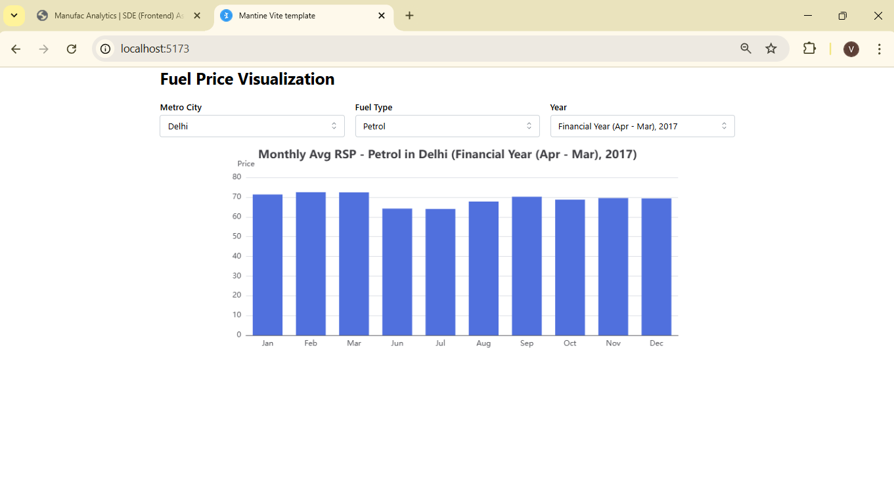

# 📊 Fuel Price Visualization Dashboard

This project is a **frontend data analysis dashboard** created as part of the **Manufac Analytics – SDE (Frontend) Assignment**.  
It visualizes the **Retail Selling Price (RSP) of Petrol and Diesel** in **Indian Metro Cities** over different years using **React (TypeScript), Vite, Mantine UI, and Apache ECharts**.

---

## 🚀 Features

- 📂 Load and parse CSV dataset using **PapaParse**
- 🔽 **Three dropdown filters**:
  - Metro City
  - Fuel Type (Petrol / Diesel)
  - Calendar Year
- 📊 **Interactive Bar Chart** (Apache ECharts) showing monthly average prices
- ⚡ Built with **Vite + TypeScript** (fast development, optimized build)
- 🎨 UI components styled with **Mantine Core**
- 🧩 Clean, modular, and scalable codebase

---

## 📂 Project Structure

vite-min-template/
│── public/
│ └── data/fuel_prices.csv # Dataset
│
│── src/
│ ├── components/
│ │ ├── Chart.tsx # ECharts visualization
│ │ └── Filters.tsx # Dropdown filters
│ ├── utils/
│ │ └── csvLoader.ts # CSV loader (PapaParse)
│ ├── types/
│ │ └── index.ts # Data type definitions
│ ├── App.tsx # Main app container
│ ├── main.tsx # Application entry point
│ └── theme.ts # Mantine theme configuration
│
│── package.json
│── tsconfig.json
│── vite.config.ts
└── README.md

---

## 🛠️ Tech Stack

- **React + TypeScript** – Frontend framework
- **Vite** – Fast bundler & dev server
- **Mantine UI** – UI components & styling
- **Apache ECharts** – Charting library
- **PapaParse** – CSV parsing

---

## ⚙️ Installation & Setup

### 1️⃣ Clone the repository

```bash
git clone <your-repo-url>
cd vite-min-template
```

### 2️⃣ Install dependencies

```bash
yarn install
# or
npm install
```

### 3️⃣ Run the development server

```bash
yarn dev
# or
npm run dev
```

Now open in browser:

```
http://localhost:5173
```

---

## 📦 Build for Production

yarn build

# or

npm run build

Preview production build locally:
yarn preview

# or

npm run preview

---

## 🌐 Deployment

🔗 **Live Demo URL**: [Add your deployed project link here]

---

## 📊 Example Visualization

### Dashboard Screenshot


